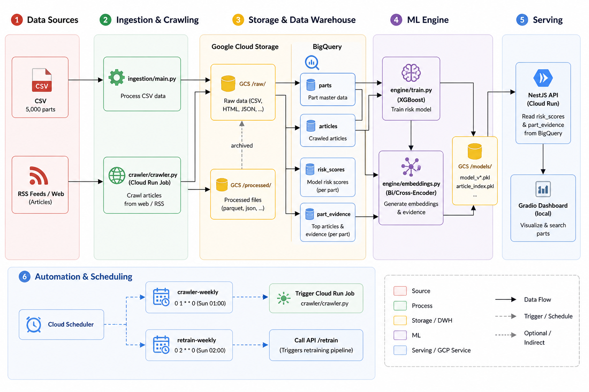

# Aerospace Parts Obsolescence Risk System

AI/ML demo trên Google Cloud để phân tích **obsolescence risk** cho phụ tùng hàng không vũ trụ (aerospace parts), tạo early warning insights và retrieval bằng embeddings.

---

## Architecture



### Component phân loại theo batch / real-time

| Component | Mode | Trigger |
|---|---|---|
| `ingestion/main.py` | Batch | Thủ công / khi có CSV mới |
| `crawler/crawler.py` | Batch | Cloud Scheduler hàng tuần (Chủ nhật 1:00 AM) |
| `engine/train.py` | Batch | POST /retrain hoặc Scheduler (Chủ nhật 2:00 AM) |
| `engine/embeddings.py` | Batch | Tự động sau mỗi lần retrain |
| `NestJS API` | Real-time | HTTP request |
| `dashboard/app.py` | Real-time | Local Gradio UI |

---

## Repository Structure

```
aerospace-obsolescence/
├── ingestion/
│   ├── main.py                  # CSV → GCS + BigQuery
│   └── generate_mock_data.py    # Tạo 5,000 rows mock data
├── crawler/
│   ├── crawler.py               # RSS crawl + synthetic fallback + GCS/BQ upload
│   ├── generate_articles.py     # Standalone article generator
│   ├── requirements.txt
│   └── Dockerfile               # Cloud Run Job image
├── engine/
│   ├── train.py                 # XGBoost → GCS model + BQ risk_scores
│   └── embeddings.py            # Bi-Encoder + Cross-Encoder → BQ part_evidence
├── api/                         # NestJS API
│   ├── src/
│   │   ├── parts/               # /parts endpoints
│   │   ├── retrain/             # /retrain endpoints
│   │   ├── db/                  # BigQuery service
│   │   └── common/guards/       # API key auth
│   └── Dockerfile
├── dashboard/
│   └── app.py                   # Gradio UI
├── infra/
│   └── setup_gcp.sh
├── data/                        # Local only — gitignored
├── .env.example
├── .gitignore
└── README.md
```

---

## AI/ML Engine Architecture

### Obsolescence Risk Scoring (XGBoost)

**Input:** 16 features từ BigQuery `parts` table

| Feature | Ý nghĩa | Importance |
|---|---|---|
| `stock_level` | Tồn kho hiện tại | 0.25 |
| `num_alternative_suppliers` | Số nhà cung cấp thay thế | 0.21 |
| `low_stock_flag` | stock < 20 | 0.12 |
| `part_age_years` | Số năm kể từ manufacture_year | 0.11 |
| `alternative_part_available_enc` | Yes/Partial/No encoded | 0.09 |
| `lead_time_days` | Thời gian cung ứng (ngày) | 0.08 |
| `category_enc`, `supplier_enc`... | Label-encoded categoricals | ... |

**Output:**
- `risk_score` (0.0–1.0) từ XGBoost Regressor
- `risk_label` (0/1) từ XGBoost Classifier
- `risk_tier`: Critical (≥0.75) / High (≥0.45) / Medium (≥0.25) / Low

**Metrics (v2):** AUC ~0.99 | MAE ~0.05

### Article Retrieval + Evidence Linking (2-stage)

**Stage 1 — Bi-Encoder** (`all-MiniLM-L6-v2`):
- Embed 1,100 articles → vector index lưu GCS
- Cosine similarity → top-50 candidates
- Fast O(1) recall

**Stage 2 — Cross-Encoder Reranker** (`ms-marco-MiniLM-L-6-v2`):
- BERT đọc (query, document) cùng lúc → full cross-attention
- Hiểu semantic: "supplier discontinued" ≈ "manufacturer exited market"
- Rerank top-50 → top-5 articles chính xác nhất

**Retrieval vs Analysis:**
- Embeddings = **retrieval** (tìm articles liên quan)
- XGBoost = **analysis/prediction** (tính risk score)

---

## Schema Design

### BigQuery Tables

```sql
-- parts
part_id, part_name, category, aircraft_model, supplier, region,
manufacture_year, lead_time_days, stock_level, unit_price_usd,
last_order_date, lifecycle_status, criticality, mtbf_hours,
num_alternative_suppliers, alternative_part_available,
obsolescence_score, obsolescence_label, obsolescence_reason,
expected_obsolescence_date, ingested_at

-- articles
article_id, url, title, summary, full_text, topic,
source_domain, published_at, crawled_at, tags, word_count, ingested_at

-- risk_scores
part_id, risk_score, risk_label, risk_tier,
top_features (JSON), model_version, scored_at

-- part_evidence
part_id, risk_score, risk_tier, summary,
risk_factors (JSON), article_links (JSON), generated_at
```

### GCS Structure

```
gs://nhh0608-data/
├── raw/
│   ├── aerospace_parts_dataset.csv
│   ├── articles.jsonl
│   └── crawled_YYYYMMDD_HHMMSS.jsonl
├── processed/
│   ├── parts_normalized.jsonl
│   └── articles_normalized.jsonl
└── models/
    ├── model_v1.pkl
    ├── model_v2.pkl
    ├── model_latest.pkl
    └── article_index.pkl
```

---

## Setup & Deployment

### Prerequisites
- Python 3.10+, Node.js 20+, Docker
- Google Cloud SDK (`gcloud`)
- GCP Project với billing enabled

### 1. Clone & Config

```bash
git clone https://github.com/your-username/aerospace-obsolescence
cd aerospace-obsolescence
cp .env.example .env
# Điền GCP_PROJECT, GCS_BUCKET, BQ_DATASET
```

### 2. GCP Setup

```bash
gcloud auth login && gcloud auth application-default login
gcloud config set project YOUR_PROJECT_ID
chmod +x infra/setup_gcp.sh && ./infra/setup_gcp.sh
```

### 3. Generate & Ingest Data

```bash
pip install google-cloud-storage google-cloud-bigquery pandas

python ingestion/generate_mock_data.py
python crawler/generate_articles.py

export $(cat .env | xargs)
python ingestion/main.py
```

### 4. Train ML Model

```bash
pip install xgboost scikit-learn sentence-transformers

python engine/train.py
python engine/embeddings.py
```

### 5. Run API Locally

```bash
cd api && npm install
cp .env.example .env
npm run build && npm run start:prod
```

### 6. Run Gradio Dashboard

```bash
pip install gradio requests
python dashboard/app.py
# Mở http://localhost:7860
```

### 7. Deploy API → Cloud Run

```bash
cd api && npm run build
gcloud auth configure-docker asia-southeast1-docker.pkg.dev
docker build -t asia-southeast1-docker.pkg.dev/PROJECT/aerospace-repo/api:latest .
docker push asia-southeast1-docker.pkg.dev/PROJECT/aerospace-repo/api:latest

gcloud run deploy aerospace-api \
  --image=asia-southeast1-docker.pkg.dev/PROJECT/aerospace-repo/api:latest \
  --platform=managed --region=asia-southeast1 --allow-unauthenticated \
  --set-env-vars="GCP_PROJECT=PROJECT,GCS_BUCKET=BUCKET,BQ_DATASET=aerospace_obs,API_KEY=KEY"
```

### 8. Deploy Crawler → Cloud Run Job

```bash
cd crawler
docker build -t asia-southeast1-docker.pkg.dev/PROJECT/aerospace-repo/crawler:latest .
docker push asia-southeast1-docker.pkg.dev/PROJECT/aerospace-repo/crawler:latest

gcloud run jobs create crawler-job \
  --image=asia-southeast1-docker.pkg.dev/PROJECT/aerospace-repo/crawler:latest \
  --region=asia-southeast1 \
  --set-env-vars="GCP_PROJECT=PROJECT,GCS_BUCKET=BUCKET,BQ_DATASET=aerospace_obs"
```

### 9. Cloud Scheduler

```bash
# Crawler — Chủ nhật 1:00 AM
gcloud scheduler jobs create http crawler-weekly \
  --location=asia-southeast1 --schedule="0 1 * * 0" \
  --uri="https://asia-southeast1-run.googleapis.com/apis/run.googleapis.com/v1/namespaces/PROJECT/jobs/crawler-job:run" \
  --http-method=POST --oauth-service-account-email=SA_EMAIL

# Retrain — Chủ nhật 2:00 AM
gcloud scheduler jobs create http retrain-weekly \
  --location=asia-southeast1 --schedule="0 2 * * 0" \
  --uri="https://YOUR_RUN_URL/api/v1/retrain" \
  --http-method=POST \
  --headers="Content-Type=application/json,X-API-Key=KEY" \
  --message-body='{"reason":"scheduled_weekly"}'
```

---

## API Reference

Header bắt buộc: `X-API-Key: YOUR_KEY`

| Endpoint | Method | Mô tả |
|---|---|---|
| `/api/v1/parts/stats` | GET | Tổng quan hệ thống |
| `/api/v1/parts/early-warning` | GET | Top parts risk cao, filter tier/category/aircraft |
| `/api/v1/parts/:id/risk-score` | GET | Risk score + evidence + articles |
| `/api/v1/retrain` | POST | Trigger retrain |
| `/api/v1/retrain/status` | GET | Trạng thái + model history |

---

## Model Retraining Flow

```
Trigger → engine/train.py --version N
  ├── Load parts từ BigQuery
  ├── Train XGBoost (AUC ~0.99, MAE ~0.05)
  ├── Score 5,000 parts → BigQuery:risk_scores
  └── Upload model_vN.pkl + model_latest.pkl → GCS
          ↓
      engine/embeddings.py --rebuild-index
  ├── Rebuild Bi-Encoder index → GCS
  ├── Cross-Encoder rerank top-50 parts
  └── Save evidence → BigQuery:part_evidence
          ↓
      API tự động đọc data mới (stateless)
```

**Rollback:**
```bash
gsutil cp gs://BUCKET/models/model_v1.pkl gs://BUCKET/models/model_latest.pkl
```

---

## Deployed Endpoints (Live)

- **API:** `https://aerospace-api-1034183854132.asia-southeast1.run.app`
- **Dashboard:** `python dashboard/app.py` → `http://localhost:7860`

---

## Assumptions & Limitations

**Assumptions:**
- Data synthetic với correlation có chủ đích giữa features và label
- Articles gồm RSS thật + synthetic fallback
- Model retrain dùng `WRITE_TRUNCATE` — overwrite toàn bộ mỗi lần

**Limitations:**
- AUC ~0.99 do data synthetic; real data sẽ thấp hơn
- `part_evidence` chỉ cover top-50 parts, chưa toàn bộ 5,000
- Retrain chạy trong Cloud Run — không phù hợp dataset lớn (nên dùng Vertex AI)
- Chưa có model evaluation gate trước khi promote version mới

**Production improvements:**
- Vertex AI Training Job cho retrain
- Incremental embedding update
- Model evaluation gate (AUC threshold)
- Vertex AI Vector Search thay vì pkl trên GCS